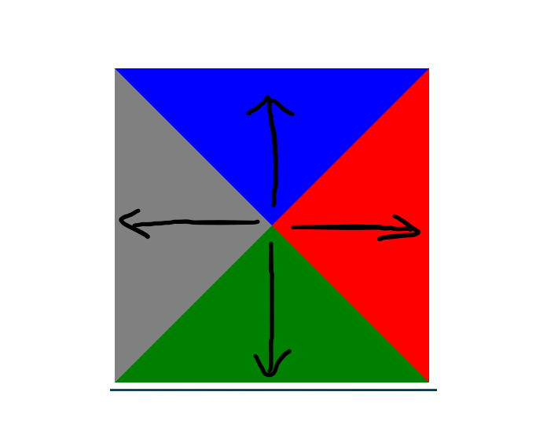
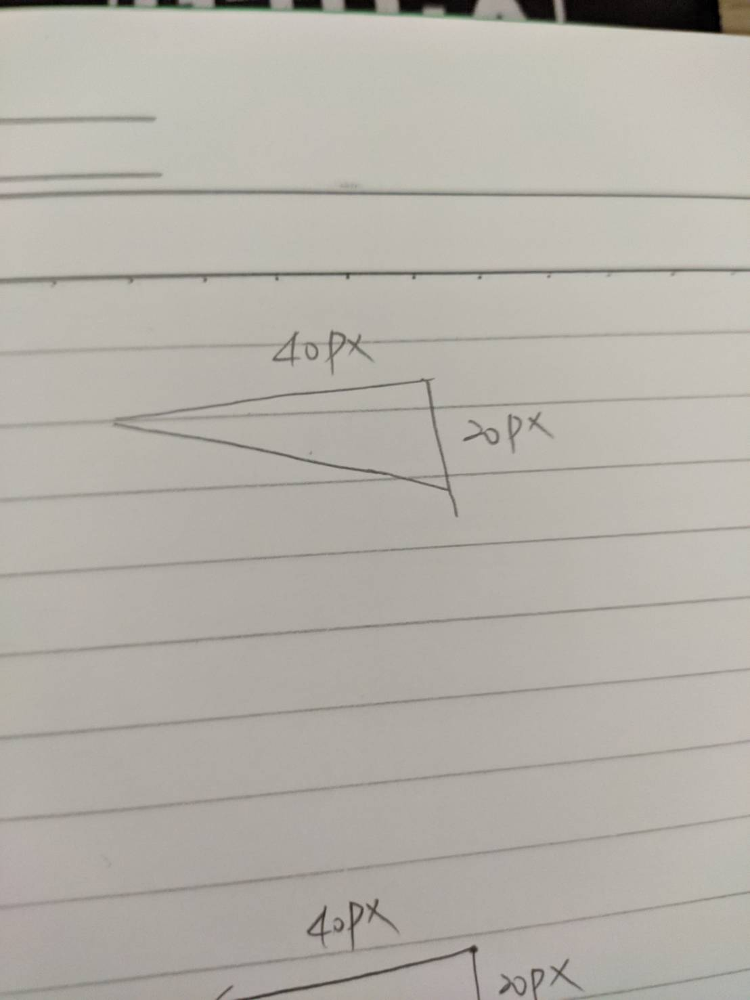
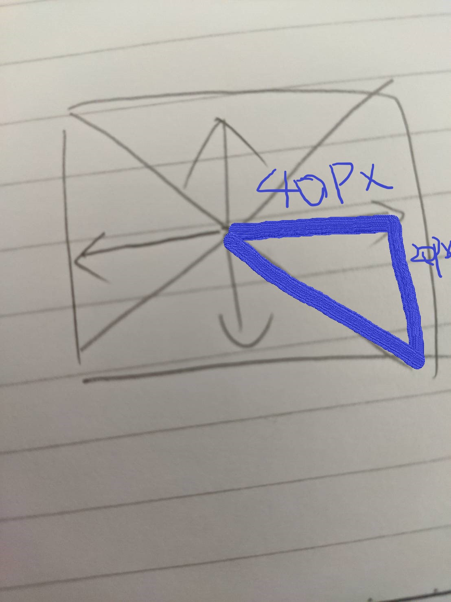

# 用Css畫三角形或是對話框


* 主要是利用border的color以及顏色來描繪


```html
<body>
    <div class="border">
</body>
```

```css
.border{
    border-width: 200px;
    height: 0;
    width: 0;
    border-color:blue red green gray;
    border-style: solid;
}
```

* 可以看到以下圖示因為border-width是200px 他會從中間往外算200px而做擴展
* 建議是在做三角形時可以先用手繪畫一個像這樣的圖來後再去構想




## 舉例
* 假設我要的三角形是這個樣子的


* 這啥我們就可以畫一個類似上面的圖如下

可以看到從圖中找到由切線找到類似的三角形
所以我們需要border-right是40px 以及border-bottom是20px 顏色則是在border-right那邊

```html
<body>
    <style>
        .border-2{
            border-right:blue 40px solid;
            height: 0;
            width: 0;
            border-bottom:transparent 20px solid;
        }
    </style>
    <div class="border-2"></div>
</body>
```

## 製作對話框
* 使用偽元素做一個三角形鑲嵌在上面即可

```html
    <div class="chat"></div>
    <div class="chat2"></div>
```

```css
        .chat {
            width: 200px;
            height: 200px;
            background-color: #eee;
            position: relative;
            margin-bottom: 200px;
        }

        .chat::after {
            content: "";
            position: absolute;
            bottom:-40px;
            left:45%;
            border-color:#eee transparent transparent transparent;
            border-width: 40px 0 0 20px;
            border-style:solid;
        }

        .chat2{
            width: 200px;
            height: 200px;
            background-color: #eee;
            position: relative;
            margin-bottom: 50px;
        }

        .chat2::after{
            content:"";
            position: absolute;
            top:-40px;
            left:45%;
            border-width:0 0 40px 20px;
            border-color:transparent transparent #eee transparent;
            border-style:solid;
        }
```

