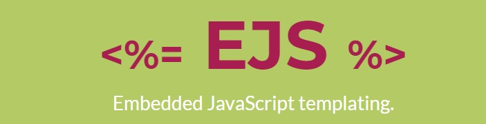

# EJS



## Introduction
EJS 的全名是「Embedded Javascript」，顧名思義就是內嵌式的樣板引擎，可以將邏輯與內容直接嵌入到 HTML 頁面上，也就是 EJS 可以讓我們利用 JavaScript 生成 HTML 頁面 。而 EJS 學習上相對簡單，因為它沒有如何組織内容的教條；也没有再造一套迭代和控制流語法。我們只要本身會 HTML 和 JavaScript 即可上手！
* 使用上搭配koa express 使用上相當簡單上手
* 以下會以koa的語法來做搭配

## 常見語法
* Variable
    * <%= name %>


```js
ctx.render("index",{test:"hello"})
```

```html
<body>
  <%= test %>
</body>
```

* Variable 以網頁的方式傳入

```js
ctx.render("index",{test:"<p>hello,world</p>"})
```

index.ejs
```html
<%- test %>
```


## Include
    * 將其他的template加入近來
index.ejs
```html
<body>
  <%- include('./layout/header',{place:"home"}); %>
</body>
```
header.ejs

```html
<div><%= place %></div>
```

## Script
* 宣告變數

```html
  <% let test = "test" %>
```
* For 迴圈
```js
posts = [{title:"hello",content:"hello,world"},{title:"test",content:"test content"}]
ctx.render("index",{posts:posts})
```

```html
<body>
  <% for(let post of posts){ %>
    <p>post.title</p>
    <p>post.content</p>
  <% } %>
</body>
```


* If判斷式

```html
<body>
    <% if(alive = true){ %>
        <p>alive</p>
    <% }else{ >
        <p>not alive</p>
    <% } %>
</body>
```