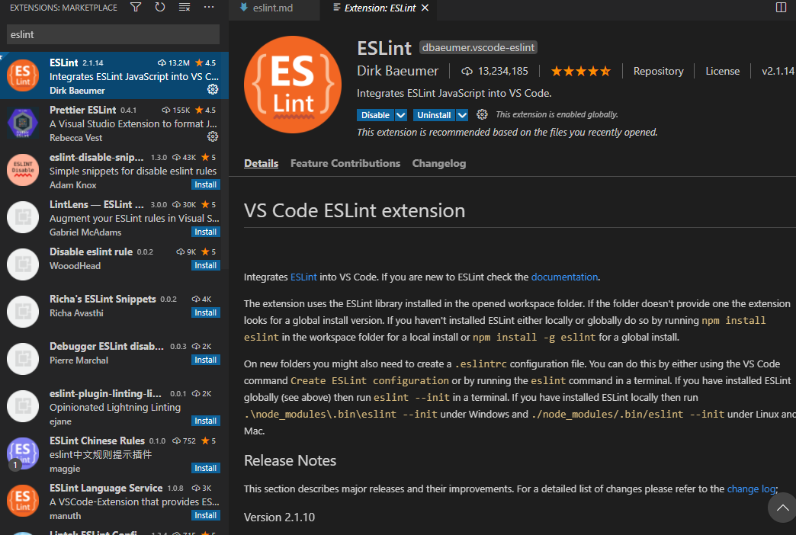
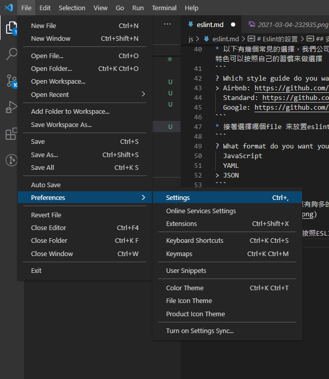
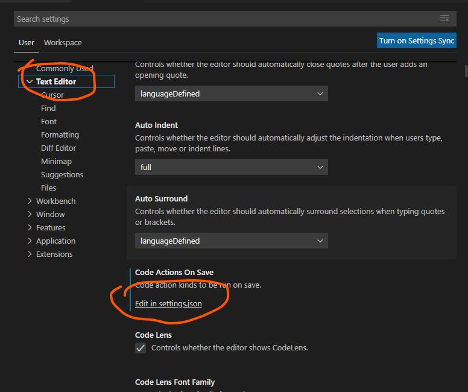
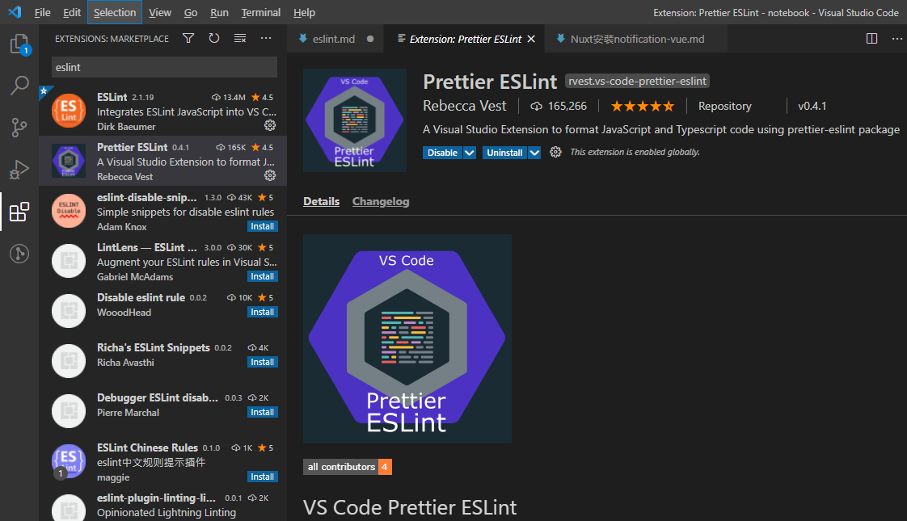

# Eslint的設置

## 介紹
* Eslint其實在早期上課就有聽到老師在說，但那時想說寫個程式還給自己那麼多規範有夠麻煩的，就沒特別接觸，直到開始工作才發現為了整合大家的coding style而需要一些標準化，我們公司目前是用Eslint，還是挺不習慣的但是vscode可以自動更改也是相當方便，以下會介紹安裝與使用~
* eslint是一個方便管理大家的coding style的一個標準化的工具
* 環境是使用windows安裝，手邊只有windows


## 安裝
* 安裝vscode裡面的eslint工具


* 使用npm安裝eslint，建議加入-g使用全域
```
$ npm install -g eslint
```

* 接著即可在自己的專案加入設定eslint
    * 如果沒有專案可先npm init，先創一個package.json
    ````
    $ npm init
    ````
* 安裝完設定eslint
```
$ eslint --init
```
* 前面幾個選擇看自己的選擇
* 到了要使用哪個project,建議選擇use a popular style guide
```
√ How would you like to use ESLint? · style
√ What type of modules does your project use? · esm
√ Which framework does your project use? · vue
√ Does your project use TypeScript? · No / Yes
√ Where does your code run? · browser
? How would you like to define a style for your project? ...
> Use a popular style guide
  Answer questions about your style
  Inspect your JavaScript file(s)
```
* 以下有幾個常見的選擇，我們公司目前是使用Standard，是不使用分號的，每一個都有自己的特色可以按照自己的習慣來做選擇
```
? Which style guide do you want to follow? ...
> Airbnb: https://github.com/airbnb/javascript
  Standard: https://github.com/standard/standard
  Google: https://github.com/google/eslint-config-google
```
* 接著選擇哪個file 來放置eslint我是都使用json，感覺比較好看~
```
? What format do you want your config file to be in? ...
  JavaScript
  YAML
> JSON
```
* 接著就開始安裝
* 安裝完再去coding會發現有夠多的紅字= =，接著就可以按照他的標準來做修改來符合他的標準


## 自動排版
* 建議再去設定儲存時自動按照ESLINT排版


* 點擊Text Editor往下滑一點即可看到Edit in Setting.json


將以下那行加入進去

```
"editor.codeActionsOnSave": {
    "source.fixAll.eslint": true
}
```

## 加入Prettier ESLINT
* 他會去依照 .eslintrc 裡面的內容去做排版在排html或是空格時特別方便的

### 安裝



### 使用
* Windows 自動排版
1. 使用default自動排版 > Shift + Alt + F
2. 每一次選取排版 > Shift + Ctrl + P > 選擇Format Document
然後選取Prettier ESLINT
* MAC
1.  CMD + Shift + P -> Format Document

* 儲存自動排版
1. 將以下內容加進 Edit in Setting.json,即可儲存自動排版
```json
"editor.formatOnSave": true
```