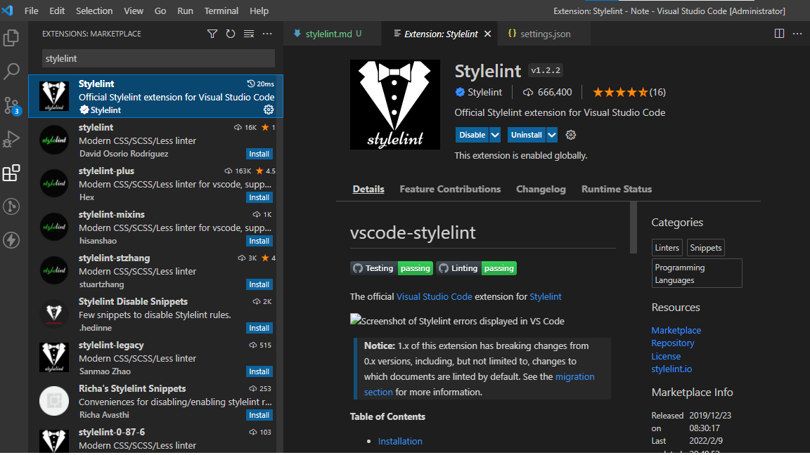

# Style Lint 設置

## 前言
由於接觸過 eslint 可以lint js 或是 vue 等等檔案，但是每一次寫 css 都沒辦法做到自動編排，導致 css lint 常常有不對齊的問題，這時就很常被其他人念XD，於是在最近才去查詢，才發現如此好用，雖然好多設置很多坑= =

## [官方文件](https://stylelint.io/)

## 安裝
 
1. 使用 npm 去安裝 stylelint 套件
```bash
$ npm install --save-dev stylelint stylelint-config-standard
```

2. 設置文件 ".stylelintrc.js"
    * 官方推薦使用 .stylelintrc.json 但由於在 json 檔內無法寫comment，當規則過多時，不寫comment 很快就不知他是做啥的了，所以在這推薦使用 js 檔， 不管是 prettire 或是 eslint 都建議使用 js 
```js
module.exports = {
    "extends": [
        "stylelint-config-standard",
    ]
} 
```

3. 設置 vscode 自動保存會做 format
    1. 安裝 stylelint extension
    
```
{
    "editor.codeActionsOnSave": {
        "source.fixAll.stylelint": true
    },
    "stylelint.validate": ["css", "scss"],
}
```

4. 設置 Vue 內的 style 也能做 lint
    ### [官方文件](https://github.com/ota-meshi/stylelint-config-recommended-vue)

    1. 安裝套件
    
    ```
    $ npm install --save-dev postcss-html stylelint-config-recommended-vue
    ```

    2. 調整 ".stylelintrc.js"

    ```js
    module.exports = {
        "extends": [
            "stylelint-config-standard",
            "stylelint-config-recommended-vue" // 讓 vue 的檔案也能吃到 .stylelint
        ],
    } 
    ```

    3. 調整 vscode setting.json, stylelint.validate 多新增 "vue" 去讓他檢查~

    ```
    "stylelint.validate": ["css", "scss", "vue"],
    ```