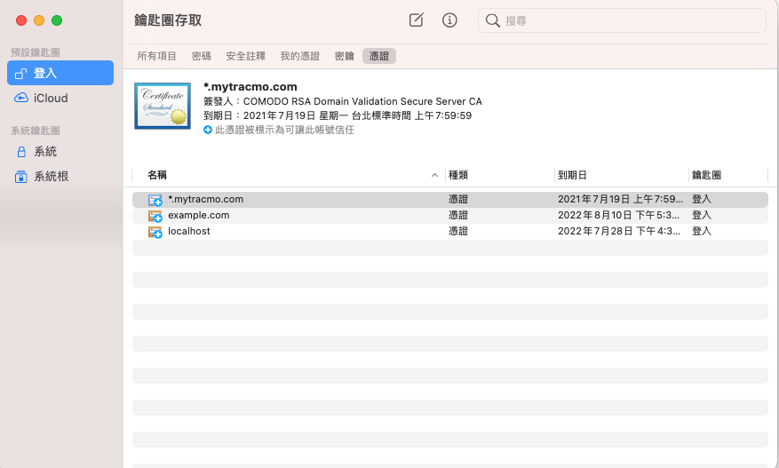
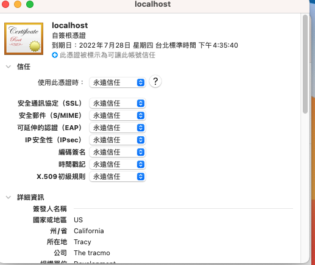

# 將網站轉為HTTPS

## Introduction
* 常常在寫前端或是後端,有些服務或多或少都需要https才能使用,例如藍芽在前端上或是U2F需要設定之類,都需要用到https,而在使用vue開啟時常常只是localhost:3000,這樣是無法使用的

## Tool
1. Openssl
    * 用來生成https需要的SSL認證

    ### Install

    ```
    $ brew install openssl
    ```

    ### Generate

    * generate key
    ```
    $ openssl genrsa -out server.key 2048
    ```

    * generate certificate
        * Common Named要填入使用的domain name

    ```
    $ openssl req -new -x509 -key server.key -out server.cert -days 365

    Country Name (2 letter code) []:
    State or Province Name (full name) []:
    Locality Name (eg, city) []:
    Organization Name (eg, company) []:
    Organizational Unit Name (eg, section) []:
    Common Name (eg, fully qualified host name) []:localhost
    Email Address []:
    ```
    ## 加入key chain

    * 將生成的server.cert移進去以下的圖片
    

    * 點擊兩下新的憑證,將全部填入永遠信任
    

## 使用Caddy
1. [Caddy Note](./caddy.md)
