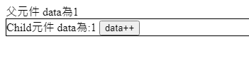

# Vue props 與 emit使用

## 介紹
* Vue props 使用在父組件傳輸資料給子組件時會使用的參數，通常如果是單向傳輸，使用props最為快速與方便，如果是雙向傳輸，或是有太多子組件會用到同筆資料則建議vuex來管理資料。


## 使用

* 先定義好父元素

index.html
```html
<body>
<div id="app">
  父元件
  data為{{ data }}
</div>
</body>
<script>
new Vue({
    data: {
        data : 1
    },
    el: "#app",
    methods:{  
    }
})
</script>
```


* 新增子元素

```html
<div id="app">
  父元件
  data為{{ data }}
  <child :number="data"></child>
</div>
<script>
Vue.component("child", {
  template: `<div class="child">
    Child元件
    data為:{{ number }}
    <button @click="add">data++</button>
  </div>`,
  props:["number"],
  methods:{
    add(){
      this.number +=1;
    }
  }
});
</script>
```

;

* 此時按下button雖然child元素有++，但父元素的Data無法做更動
* 需要加入emit事件,@update為事件如要觸發，需要再子元素裡面做emit(傳遞)即可觸發，第二個參數可傳入value讓父元素接收到
* @update="parent_update", parent_update為父元素的處理，當子元素emit被觸發則父元素接收到並會觸發methods裡面的事件來使用。


```html
<div id="app">
  父元件
  data為{{ data }}
  <child :number="data" @update="parent_update"></child>
</div>

<script>
Vue.component("child", {
  template: `<div class="child">
    Child元件
    data為:{{ number }}
    <button @click="add">data++</button>
  </div>`,
  props:["number"],
  methods:{
    add(){
      this.number +=1;
      this.$emit("update",this.number);
    }
  }
});


new Vue({
    data: {
        data : 1
    },
    el: "#app",
    methods:{  
      parent_update(val){
        this.data = val;
      }
    }
})
</script>
```

總結:在剛開始使用上常常會忘記子元件傳父元件時，@update="parent_update"這段的觸發機制，是誰觸發誰，但看久了發現因為主要是寫在父元件觸發所以parent_update必然是寫在父元件，而@update作為事件，就像是@click是事件的觸發條件，因為主要是子元件更動資料所以觸發事件會是在子元件這邊來寫，熟悉了就覺得很方便了!!

Demo:https://codepen.io/sheng-wei-lin/pen/RwGmXyW