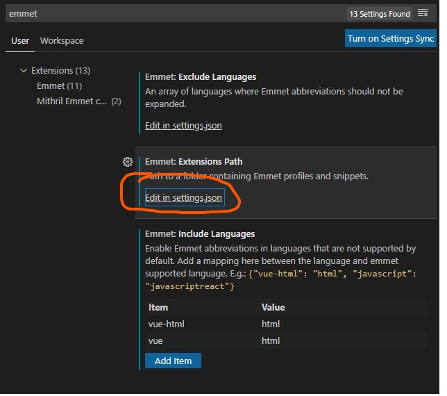

1. 進入點擊左上角File > Preference > Setting
2. 搜尋emmet

點擊Edit in setting.json


加入

```
"emmet.triggerExpansionOnTab": true,
"emmet.includeLanguages": {
    "vue-html": "html",
    "vue": "html"
}
```

* 如果有使用pug或是ejs也可自行加入!!

參考資料:<a href="https://snh90100.medium.com/%E8%A7%A3%E6%B1%BAvs-code%E4%B8%ADvue%E6%AA%94emmet%E8%AA%9E%E6%B3%95%E5%A4%B1%E6%95%88%E7%9A%84%E6%96%B9%E6%B3%95-5fa0eb5fabd4">https://snh90100.medium.com/%E8%A7%A3%E6%B1%BAvs-code%E4%B8%ADvue%E6%AA%94emmet%E8%AA%9E%E6%B3%95%E5%A4%B1%E6%95%88%E7%9A%84%E6%96%B9%E6%B3%95-5fa0eb5fabd4</a>