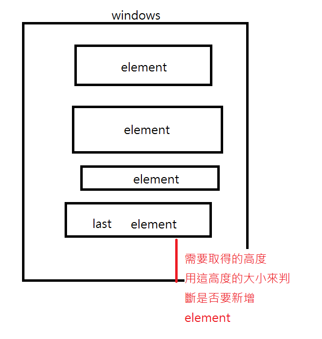
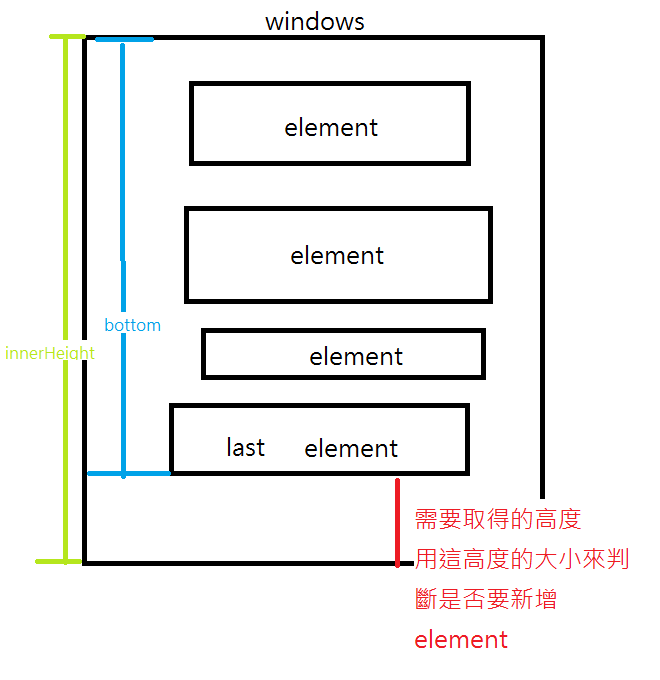

# 畫面無限滾動


## 介紹
* 像是fb的動態一樣，一直往下滑新的動態就會不斷生成新的動態
* 想法:每當最下面的element滑到快要最下面就去ajax去請求資料，所以要先了解有哪些scroll的參數可以使用，如下圖，圖用小畫家畫的有點歪歪的...


## 各種的Scroll取得

1. 取得viewport
* 整個視窗的高度
* 可介由調整瀏覽器的高度，取得不同值來驗證

```javascript
let viewport = window.innerHeight;
console.log(viewport)
```
2. 取得element對於viewport的相對位置
* 回傳是一個陣列
* width 和 height很好懂就是元素的寬與高
* top則是元素的最上端與瀏覽器的最上端的高度差別，所以當元素往下滑到沒出現在viewport則為負值
* bottom 為元素的最底部與瀏覽器的高度差別,所以跟top一樣當元素往下滑到看不到則viewport為負值

```javascript
let element_pos = element.getBoundingClientRect();
console.log(element_pos);
/* 
ClientRect {
  width: 760,   // 元素宽度
  height: 2500, // 元素高度
  top: -1352,   // 元素上边缘与屏幕上边缘的距离
  bottom: 1239, // 元素下边缘与屏幕上边缘的距离
  left: 760,    // 元素左边缘与屏幕左边缘的距离
  right: 860    // 元素右边缘与屏幕左边缘的距离
} 
*/
```

## 實作



* 使用上述兩種高度即可算出,兩個相減即可取得紅色的高度，就可以用紅色來判斷高度是否要新增元素

```javascript
window.addEventListener('scroll', function(){
    let windowHeight = window.innerHeight;
    let repo_bottom = document.querySelector(".repos").getBoundingClientRect().bottom;
    if(windowHeight - repo_bottom >= 45 && vm.isLoading == false){
        vm.getRepo();
    }
});
```

Demo:https://blackstuend.github.io/blackfloat.github.io/


參考資料:https://scarletsky.github.io/2016/04/20/how-to-implement-infinite-scroll/